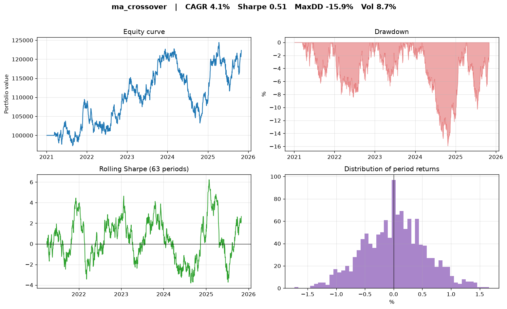
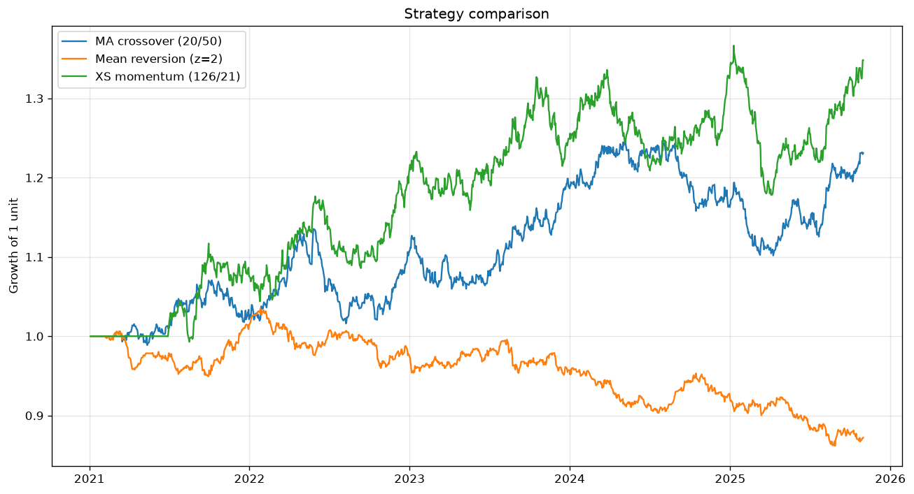
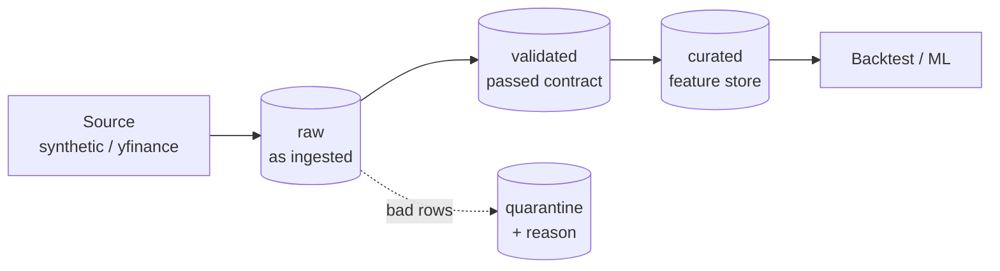
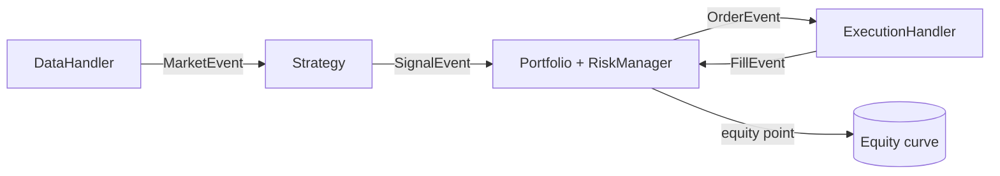

# quant-engine

**An event-driven backtesting & paper-trading engine for systematic trading strategies — with research-to-live parity.**

[](https://github.com/akaloic/quant-engine/actions/workflows/ci.yml)


`quant-engine` replays market data one bar at a time through a single event queue
— `MarketEvent → SignalEvent → OrderEvent → FillEvent` — exactly like a live
trading system. Strategies produce target weights; a portfolio sizes them; a risk
manager enforces limits; a simulated execution handler fills them with realistic
commission, slippage and market impact; and a full analytics layer turns the
resulting equity curve into a tearsheet. The **same** event loop and components
run in the historical backtest and in the live/paper loop, so going to production
means swapping the data feed and the broker — not rewriting the strategy.



> Results above are a moving-average crossover on 5 synthetic assets over ~5 years,
> **net of modelled trading costs**. All figures in this repo come from the
> deterministic synthetic data generator, so every number is reproducible.

## Why this project

It is a compact but complete trading platform that demonstrates the three sides of a
modern systematic-trading stack:

- **Data engineering** — a medallion data pipeline (`raw → validated → curated`) with
  enforced data-quality contracts (bad rows quarantined, not dropped), idempotent
  partitioned Parquet storage and a per-run lineage manifest — orchestrated by
  **Airflow** in production and runnable via one CLI command locally.
- **Quant** — event-driven design with no look-ahead bias, realistic execution and
  transaction-cost modelling, position sizing, risk limits (exposure caps,
  volatility targeting, stop-losses) and the standard risk-adjusted metrics
  (Sharpe, Sortino, Calmar, max drawdown, VaR/CVaR, turnover).
- **Engineering** — a typed, tested Python package (`pytest`, `ruff`, `mypy`, CI),
  a YAML/CLI interface, a FastAPI service, a Streamlit dashboard, Docker, and an
  MLflow-tracked XGBoost signal validated walk-forward.

Every concept is written up in plain language in [`docs/concepts.md`](docs/concepts.md).

## Quickstart

```bash
# 1. Install (core engine + dev tools). Python 3.11+
python -m venv .venv && source .venv/bin/activate
pip install -e ".[dev]"

# 2. Run a backtest on deterministic synthetic data and write a tearsheet
quant-engine backtest --strategy ma_crossover --symbols AAA,BBB,CCC,DDD,EEE --bars 1260

# 3. Or describe the whole experiment in YAML
quant-engine backtest --config examples/momentum.yaml

# 4. Generate a partitioned Parquet store, then backtest from it
quant-engine gen-data --symbols AAA,BBB,CCC --bars 756 --out data
quant-engine backtest --source parquet --symbols AAA,BBB,CCC --strategy mean_reversion

# 5. Or run the full data pipeline: ingest -> validate (data contracts) -> curated features
quant-engine pipeline --symbols AAA,BBB,CCC --bars 756 --root data/lake
```

Programmatic use is just as direct:

```python
from quant_engine.config import BacktestConfig
from quant_engine.data.synthetic import generate_prices, make_handler
from quant_engine.engine.backtest import BacktestEngine
from quant_engine.strategy.moving_average import MovingAverageCrossover

data = make_handler(generate_prices(["AAA", "BBB", "CCC"], n_bars=1260, seed=7))
result = BacktestEngine(data, MovingAverageCrossover(fast=20, slow=50), BacktestConfig()).run()
print(result.summary())
result.tearsheet("artifacts/tearsheet.png")
```

### Optional extras

```bash
pip install -e ".[data]"       # real market data via yfinance
pip install -e ".[ml]"         # XGBoost signal + MLflow tracking
pip install -e ".[service]"    # FastAPI REST API   -> quant-engine serve
pip install -e ".[dashboard]"  # Streamlit dashboard -> streamlit run dashboard/app.py
pip install -e ".[airflow]"    # Apache Airflow DAG to orchestrate the data pipeline
pip install -e ".[all]"        # everything (except the heavy airflow extra)
```

## Strategies

| Name | Idea | Key parameters |
|------|------|----------------|
| `ma_crossover` | Trend following: long when fast MA > slow MA | `fast`, `slow`, `allow_short` |
| `mean_reversion` | Fade extremes via a rolling z-score (Bollinger) | `lookback`, `entry_z`, `exit_z` |
| `xs_momentum` | Cross-sectional: long winners / short losers | `lookback`, `holding`, `long_frac` |
| `pairs` | Market-neutral stat-arb on an OLS-hedged spread | `symbol_a`, `symbol_b`, `entry_z` |
| `ml_signal` | XGBoost next-bar direction (needs `[ml]`) | `train_size`, `prob_threshold` |

Running all three core long/short strategies on the same universe shows them
behaving as theory predicts — momentum and trend profit on trending data, while
mean-reversion struggles:



## Data pipeline (medallion architecture)

Before a strategy ever sees a price, the data goes through a small but real
data-engineering layer — the standard *medallion* lakehouse pattern:



- **Ingest (raw)** — land source data as-is. Writes are **idempotent** at partition
  granularity, so re-running a load never duplicates rows; the run records a
  per-symbol high-watermark.
- **Validate (validated + quarantine)** — enforce a **data contract**: no nulls, no
  non-positive prices, no negative volume, OHLC consistency, no duplicate bars. Rows
  that fail are **quarantined with a reason**, not silently dropped, and the run
  **aborts** if the quarantine rate exceeds a threshold — bad data can't poison
  downstream. Calendar gaps (missing business days) are detected and reported.
- **Curate (curated)** — materialise the exact causal feature set the ML signal
  consumes; a lightweight **feature store**.

Everything is partitioned Parquet (`symbol`/`year`) and every run drops a JSON
**lineage manifest** (row counts, watermark, validation report). One command runs
the whole thing:

```bash
quant-engine pipeline --symbols AAA,BBB,CCC --bars 756 --root data/lake
```

In production the **same functions** are scheduled by an Airflow DAG
(`ingest → validate → curate`, with retries and the contract gate) — see
[`airflow/`](airflow/). The orchestration is a thin wrapper, so what runs nightly is
exactly what runs in CI.

## Architecture



A single FIFO event queue decouples the stages and enforces sequential processing,
which is what eliminates look-ahead bias. Full write-up in
[`docs/architecture.md`](docs/architecture.md).

## Project layout

```
src/quant_engine/
├── core/         # typed events (Market/Signal/Order/Fill) + shared enums
├── data/         # DataHandler, synthetic GBM generator, Parquet store, yfinance
├── pipeline/     # medallion data lake: ingest -> validate (contracts) -> curate
├── strategy/     # base + ma_crossover, mean_reversion, xs_momentum, pairs, ml_signal
├── portfolio/    # positions, cash, sizing, mark-to-market equity curve
├── risk/         # exposure caps, vol-targeting, stop-losses, VaR/CVaR
├── execution/    # simulated fills: commission, slippage, market impact
├── engine/       # BacktestEngine + LivePaperEngine (shared loop = parity)
├── analytics/    # performance metrics + matplotlib tearsheet
├── ml/           # causal features + walk-forward training (MLflow)
└── service/      # FastAPI app
airflow/          # Airflow DAG orchestrating the data pipeline
dashboard/        # Streamlit UI
examples/         # runnable scripts + YAML configs
tests/            # 48 tests: events, execution, accounting, metrics, parity, data contracts
```

## Quality & reproducibility

```bash
pytest        # full suite (no network, deterministic)
ruff check .  # lint
mypy          # static types (strict-ish)
```

- **Deterministic**: seeded synthetic data + a single-threaded ordered loop ⇒ same
  inputs always give the same result. A dedicated test asserts backtest/live parity
  is bit-for-bit identical, and another asserts the data handler never reveals a
  future bar.
- **CI**: GitHub Actions runs ruff + mypy + pytest on Python 3.11 and 3.12.

## Docker

```bash
docker compose up dashboard   # Streamlit on http://localhost:8501
docker compose up api         # FastAPI on   http://localhost:8000/docs
```

## Roadmap

- Limit/stop order types in the execution handler
- Broker adapters (Interactive Brokers / Alpaca / crypto exchanges) implementing the
  `DataHandler` / `ExecutionHandler` interfaces for true live trading
- Multi-frequency (intraday) bars and a corporate-actions-aware data layer

## License

MIT © Loïc Jiraud — see [LICENSE](LICENSE).

> Educational/research project. Nothing here is investment advice; past (or
> simulated) performance does not guarantee future results.
