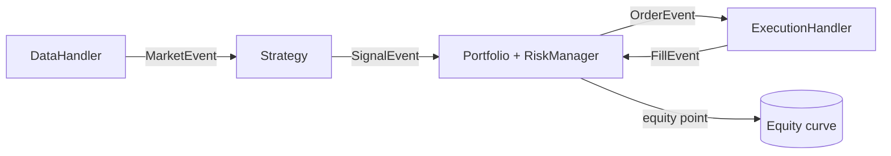

# Architecture

`quant-engine` is an **event-driven** trading engine. Components never call each
other directly; they communicate by pushing typed events onto one shared FIFO
queue, which the engine drains one event at a time. This is the same design used
by production engines like NautilusTrader, and it is what gives the system its two
headline properties: **no look-ahead bias** and **research-to-live parity**.

## Event flow

For each heartbeat (one bar), the engine:

1. **Stops** — the portfolio checks stop-losses on open positions and emits any
   forced exits; the queue is drained to settle them.
2. **Signals** — the strategy reads history (only up to *now*) and emits target
   weights as `SignalEvent`s.
3. **Cascade** — the queue is drained: each signal becomes an `OrderEvent`
   (after sizing + risk), each order becomes a `FillEvent` (after costs), each
   fill updates cash and positions.
4. **Mark-to-market** — the portfolio records an equity point.

Settling stops and strategy trades in two separate drains keeps the accounting
unambiguous, and processing one bar fully before advancing guarantees the strategy
never sees a future price.

## Components

| Layer | Module | Responsibility |
|-------|--------|----------------|
| Data | `data/` | Replay history bar-by-bar; expose only past bars. Synthetic generator, Parquet store, optional yfinance. |
| Strategy | `strategy/` | Turn market data into target weights. MA crossover, mean-reversion, cross-sectional momentum, pairs, XGBoost. |
| Portfolio | `portfolio/` | Book of record: positions, cash, sizing, equity curve. |
| Risk | `risk/` | Exposure caps, vol-targeting, stop-losses, VaR/CVaR. |
| Execution | `execution/` | Simulate fills with commission, slippage and market impact. |
| Engine | `engine/` | The event loop: `BacktestEngine` and `LivePaperEngine`. |
| Analytics | `analytics/` | Performance metrics and the tearsheet. |
| ML | `ml/` | Causal features + walk-forward training with MLflow. |
| Service | `service/` | FastAPI app to launch runs over HTTP. |

## Determinism

Given the same data and config, a run produces identical results: the loop is
single-threaded and ordered, the synthetic data is seeded, and there is no hidden
global state. This is what makes backtests reproducible and unit-testable.

## Extending to live trading

`LivePaperEngine` already reuses the full backtest code path. To trade a real
venue you implement two interfaces against your broker's API:

- a `DataHandler` whose `update_bars()` blocks until the next live bar arrives;
- an `ExecutionHandler` whose `execute_order()` routes to the broker and emits a
  `FillEvent` from the confirmation.

Strategy, portfolio, risk and analytics code is untouched.
